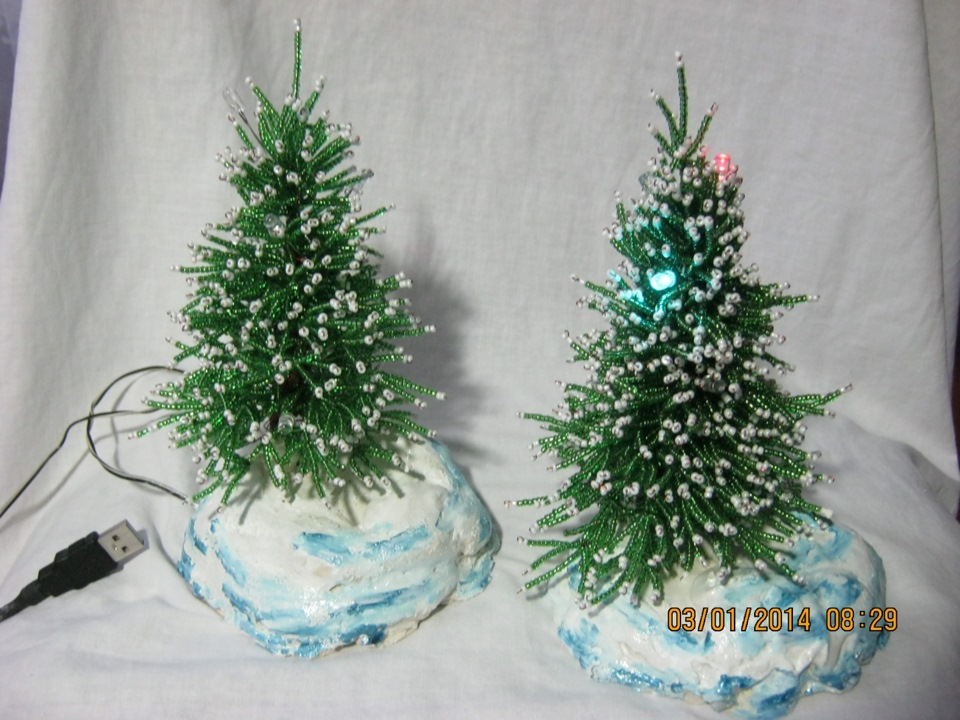

# NetOther
.Net small programs

ChristmasSong - a beaded Christmas tree with a microcontroller Atmega8. Made in begin 2014. 
А simple example of melody playback on .Net (which was used in the microcontroller, rewritten for the PC).

[Console App](./ChristmasSong/Binary)